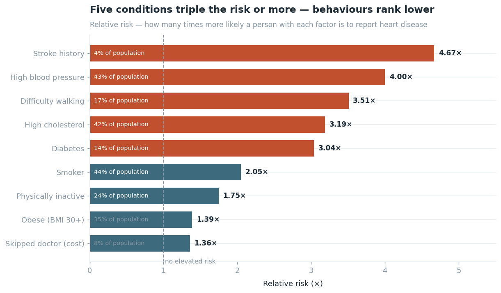
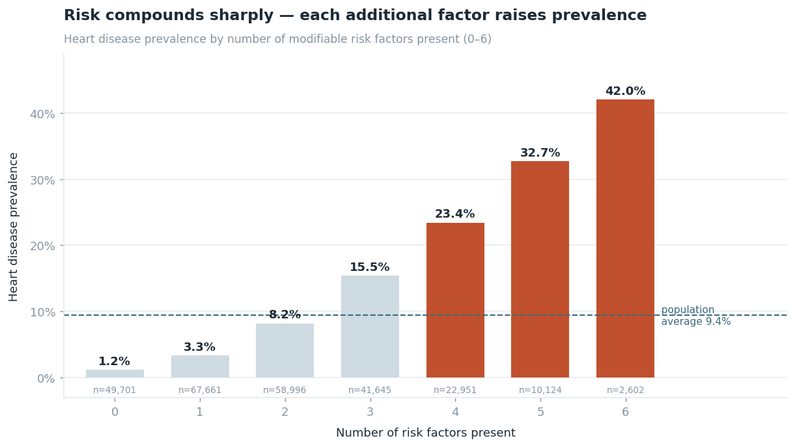
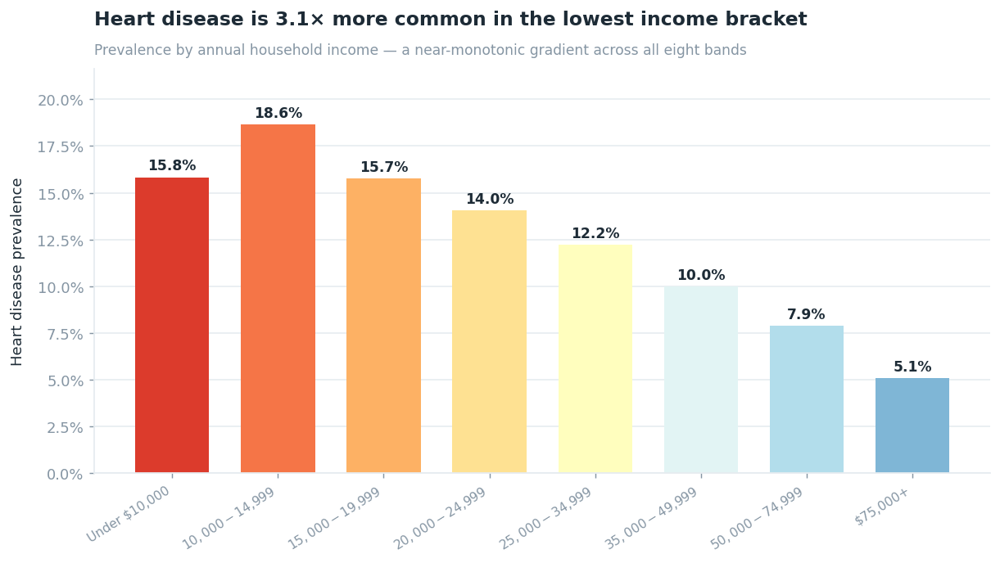
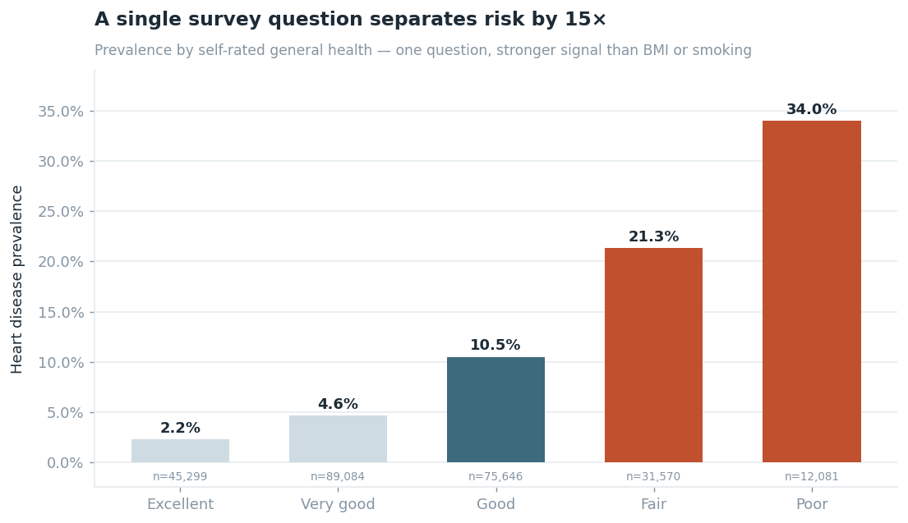
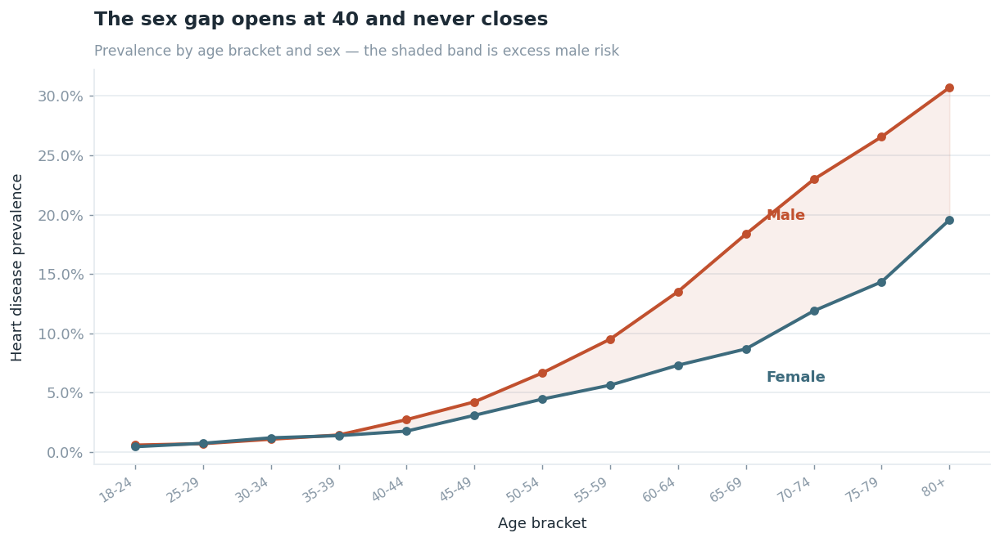
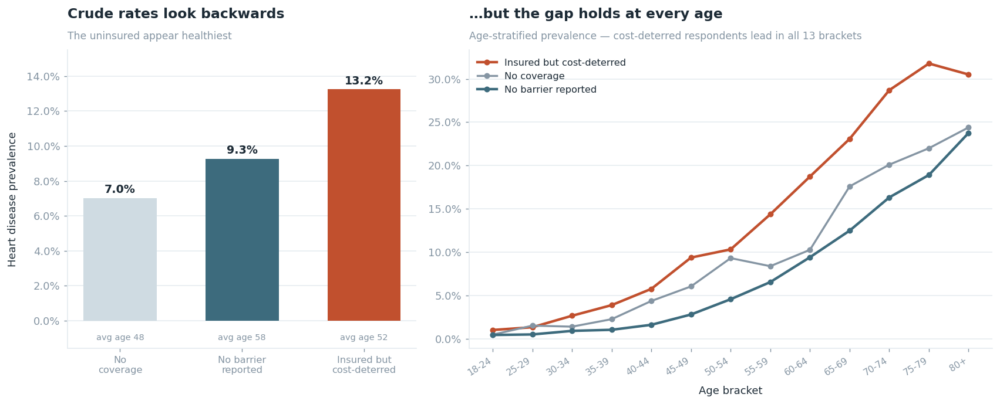

# Heart Disease in the U.S. Adult Population

### An analysis of 253,680 BRFSS 2015 respondents

**Data:** CDC Behavioral Risk Factor Surveillance System, 2015
**Baseline prevalence:** 9.42% — 23,893 respondents reported coronary heart disease or a myocardial infarction

---

## Summary

Three findings, in order of how much they should change what you do about it:

1. **Risk compounds, it doesn't add.** A person with all six modifiable risk factors is **36× more likely** to have heart disease than someone with none (42.0% vs 1.2%). Interventions that remove one factor from a high-burden patient are worth far more than removing one from a low-burden patient.

2. **Poverty is a cardiac risk factor.** Prevalence runs **3.1× higher** in the lowest income bracket than the highest (15.8% vs 5.1%), and the gradient is near-monotonic across all eight bands.

3. **Being insured is not the same as having access.** Respondents who have coverage but skipped a doctor because of cost have the **highest prevalence of any access group — 13.2%**, above both the uninsured (7.0%) and those reporting no barrier (9.3%). This survives age stratification.

---

## 1. Which factors matter most

Relative risk was used rather than correlation. On binary survey data, correlation coefficients compress badly and understate effects that matter clinically.

| Factor | Prevalence with | Prevalence without | Relative risk | Population share |
|---|---|---|---|---|
| Stroke history | 38.3% | 8.2% | **4.67×** | 4% |
| High blood pressure | 16.5% | 4.1% | **4.00×** | 43% |
| Difficulty walking | 23.2% | 6.6% | **3.51×** | 17% |
| High cholesterol | 15.6% | 4.9% | **3.19×** | 42% |
| Diabetes | 22.3% | 7.3% | **3.04×** | 14% |
| Smoker | 13.2% | 6.4% | 2.05× | 44% |
| Physically inactive | 13.9% | 8.0% | 1.75× | 25% |
| Obese (BMI 30+) | 11.5% | 8.3% | 1.39× | 38% |
| Skipped doctor (cost) | 12.4% | 9.1% | 1.36× | 8% |

**Read this alongside population share, not on its own.** Stroke history carries the highest relative risk but affects only 4% of the population. High blood pressure carries nearly the same risk and affects **43%** — which makes it the single largest lever at population scale.

The ranking also cuts against intuition: obesity, the most publicly discussed cardiac risk factor, ranks second-to-last at 1.39×. It is common, but on its own it separates the population far less sharply than blood pressure or cholesterol.

---

## 2. Risk compounds

Counting how many of six modifiable factors a person carries produces the sharpest stratification in the dataset.

| Risk factors | Prevalence | Respondents |
|---|---|---|
| 0 | 1.2% | 49,701 |
| 1 | 3.3% | 67,661 |
| 2 | 8.2% | 58,996 |
| 3 | 15.5% | 41,645 |
| 4 | 23.4% | 22,951 |
| 5 | 32.7% | 10,124 |
| 6 | 42.0% | 2,602 |

Each additional factor roughly doubles prevalence at the low end and adds ~9 points at the high end. The 35,677 people carrying 4+ factors are 14% of the sample but represent the clearest targeting opportunity in the data.

---

## 3. The income gradient

Prevalence falls almost monotonically as income rises — 15.8% under $10,000, 5.1% above $75,000. The one break in the pattern sits between the two lowest brackets (15.8% then 18.6%), which is worth flagging rather than smoothing over: the very lowest bracket includes a younger, more mixed population than the band immediately above it.

This gradient is not explained away by age, and it points toward a structural rather than purely behavioural driver.

---

## 4. Self-rated health outperforms measured factors

A single question — "would you say your general health is excellent, very good, good, fair, or poor?" — separates prevalence from 2.2% to 34.0%, a **15× spread**. That is a wider separation than BMI, smoking, or physical activity produce.

For a screening context this is a practical finding: one subjective question carries more discriminatory signal than several measured ones.

---

## 5. Age and sex

Prevalence rises from under 1% below age 30 to 24% at 80+. Men and women track together until roughly age 40, after which a gap opens and never closes. Overall male prevalence is **1.7× female** (12.3% vs 7.2%).

---

## 6. The access paradox

This is the finding worth the most scrutiny, because the crude numbers look wrong.

| Access group | Prevalence | Mean age |
|---|---|---|
| No coverage | 7.0% | 47.9 |
| No barrier reported | 9.3% | 58.2 |
| **Insured but cost-deterred** | **13.2%** | 52.5 |

At face value the uninsured look healthiest — which would be an absurd conclusion. The obvious suspect is age: uninsured respondents are the youngest group (mean 47.9), and age dominates cardiac risk.

**So the comparison was re-run within each age bracket.** The cost-deterred group has higher prevalence than the no-barrier group in **all 13 brackets**, often by a factor of 1.5–2× in middle age. And they are *younger* on average than the no-barrier group (52.5 vs 58.2), meaning the crude figure understates the gap rather than inflating it.

**Interpretation.** The uninsured group's low rate is a composition effect — it skews young (39% under 45, vs 28% of the cost-deterred group) and healthy people are likelier to go without coverage. The cost-deterred group is the real signal: people who hold insurance, need care, and don't get it. Insurance status alone is a poor measure of healthcare access.

**Caveat.** This is cross-sectional survey data. Causal direction cannot be established here — sicker people may face more cost barriers precisely because they need more care. The finding identifies a population worth studying, not a proven mechanism.

---

## Limitations

- **Self-reported.** All outcomes and risk factors are respondent-reported, not clinically verified. Heart disease prevalence is likely underestimated, since undiagnosed cases cannot appear.
- **Cross-sectional.** A single year, no follow-up. No causal claims are made.
- **Survey weights not applied.** BRFSS provides weights for national representativeness; this analysis uses raw counts and reports sample prevalence, not weighted national estimates.
- **Class imbalance.** 9.4% positive cases. Any predictive modelling on this data must account for it — accuracy would be a misleading metric.
- **Duplicate rows retained.** 23,899 exact duplicate rows were kept as distinct respondents. See `data_quality_report.md` for the reasoning and the 0.9pp impact of the alternative.
